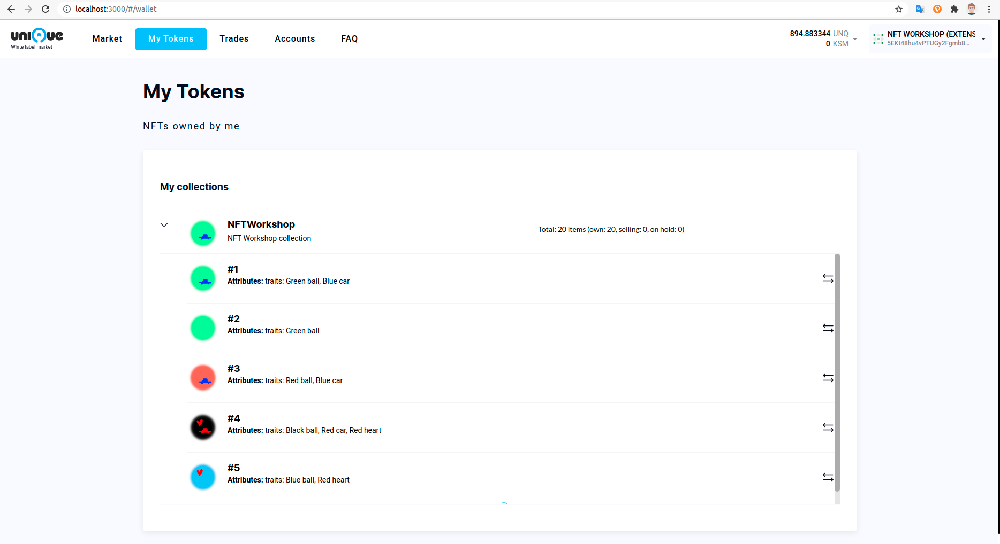

# Tutorial: Create your own NFT Collection

## Who is this tutorial for

This tutorial is created for technologically skillful people (e.g. game developers) who desire to create NFT collections from auto-generated images such as Substrapunks, Crypto-kitties, etc.

## Prerequisites

  * OS: Ubuntu 18.04 or 20.04
  * NodeJS 16 or up
  * Image editor of your choice

## Design image parts

The image parts should generally include some background and combinable parts with transparent background. Store them in `images` folder. In this example there is a single background image that is stored in `head1.png` file:


If you had three background images, store them respectively in `images/head1.png`, `images/head2.png`, and `images/head3.png` files.

The combinable parts are stored as `eye*.png`, `brow*.png`, `nose*.png`, `hair*.png`, and `mouth*.png`, so when a particular combination of parts is composed, it results in a unqiue NFT image:


The combinable parts are also stored in numbered files like `images/eye1.png`, `images/eye2.png` ... and `images/nose1.png`, `images/nose2.png` ...

If you want to set a `cover` for a collection, then save the cover file in `images` folder. Store the cover file name in the `coverFileName` property in the `config.js` file. If you do not need to create a cover, then assign an empty string to `coverFileName`.

## Describe NFT traits

Generally, combinable parts produce NFT traits. For example, if the `nose1.png` image is used to generate the NFT image, it will have `Snub Nose` trait. Here is how to code this:

Create `config.js` from `config.example.js` file. The property `attributes` in `config.js` file should describe traits of your NFT collection. Each trait should have 

  * A `name` field that is used as a file name prefix for accessing your NFT part images. For example, all "nose" images are kept in files like `images/nose1.png`, `images/nose2.png`, etc.
  * A `required` field basically tells the image generator that a certain trait should always be present or not
  * The `values` field contains trait names. For example, the `images/nose1.png` adds a Snub Nose to the NFT. If you want to make a particular trait more frequent, add a `weight` to the value of the trait name.

```
    attributes: [
        { name: "head", required: true, values: ["Regular Head"] },
        { name: "eye", required: true, values: ["Normal Eyes", "Tired Eyes", "Brused Eyes"] },
        { name: "brow", required: true, values: ["Thick Brows", "Greyish Brows", "Flat Brows"] },
        { name: "nose", required: true, values: ["Snub Nose", "Button Nose", "Droopy Nose"] },
        { name: "hair", required: false, values: ["Normal Hair", "Hipster Style", "Messy Hair", "Overdue for Haircut", "Bald Patches"] },
        { name: "mouth", required: true, values: ["Smirk", "Regular Smile", {value: "Wide Smile", weight: 3}] }
    ]
```

The order in which traits come is important: It is used as a z-order when images are merged. The traits (parts) that come lower in the list of traits will be added to the image later, so they will cover up parts that come earlier.

## Prepare Substrate Address with Seed

If you have never worked with Substrate addresses and seeds before, use these steps from the Marketplace README guide:

  * [Install Polkadot{.js} Extension](https://github.com/UniqueNetwork/marketplace-docker#step-1---install-polkadotjs-extension)
  * [Create Admin Address](https://github.com/UniqueNetwork/marketplace-docker#step-2---create-admin-address)
  * [Get Unique Tokens](https://github.com/UniqueNetwork/marketplace-docker#step-3---get-unique)


## Configure Collection Owner Seed

Once you have the Seed Phrase ready, add your Seed Phrase to the `config.js` in `ownerSeed` field (replace `//Alice`):

```
const config = {
    endpoint: 'https://rest.unique.network/opal',
    ownerSeed: '//Alice',

    imagePartsFolder: './images',
    imagePrefix: 'workoholic_',
    imageWidth: 1706,
    ...
```

#### Public endpoints

You can use public endpoints for access Rest:

#### Opal
```
https://rest.unique.network/opal/v1
```

#### Quartz
```
https://rest.unique.network/quartz/v1
```

#### Unique
```
https://rest.unique.network/unique/v1
```

## Step 1: Generate NFT Properties

Set the required number of tokens in the `config` file using the `requiredCount` filed.

Execute following commands in the terminal. The `step1-nft-generator.js` script will generate a unique set of NFT properties for each NFT.

```
npm install
node step1-nft-generator.js
```

This script will create `generated-nfts` folder, and save two files: `nfts.json` - array of NFT properties for each NFT.

## Step 2: Generate NFT Images

First, set the correct image width in the `imageWidth` method in `config.js` property as shown below so that the image merging library knows how to offset image parts:
```
imageWidth: 1706,
```

This script will generate NFT images from image parts using the NFT properties generated in the previous step.

```
node step2-image-generator.js
```

This script will add NFT images to `generated-nfts` folder.

## Step 3: Create Collection

At this step you will host images on IPFS, create the NFT collection and set it's properties on-chain.

First, configure the main collection properties such as name, description, and token prefix in `step3-create-collection.js` file. Note that these properties cannot be changed after the collection is created:
```
const inputDataForCreateCollection = {
  mode: 'Nft',
  name: 'NFTWorkshop',
  description: 'NFT Workshop collection',
  tokenPrefix: 'TMP',
  metaUpdatePermission: 'ItemOwner',
  ...
```

Now you are ready to execute the blockchain transactions:
```
node step3-create-collection.js
```

A typical terminal output for this script should look like follows:

<details>
  <summary>Click to expand</summary>

```
$ node step3-create-collection.js
/usr/bin/node /home/anna/Desktop/projects/main-workshop/nft-workshop/step3-create-collection.js
=== Upload images ===
Images uploaded and available by https://ipfs.uniquenetwork.dev/ipfs/QmcBmP2AerP9TdpoXEs3SFkMcVZ78Uy31tFVemvZonuDHj
=== Create collection ===
Collection created: 224
```  

</details>

Note the output of the collection ID: 
```
Collection created: 224
```

## Step 4: Mint NFTs

1. Configure collection ID in `config.js` file in field `collectionId`:

...
    collectionId: 224
...

2. Now it's time to mint NFTs. Execute this script and wait for it to complete:
```
node step4-create-items.js
```

A typical terminal output for this script should look like follows:

<details>
  <summary>Click to expand</summary>

```
$ node step4-create-items.js
=== Create items ===
successfully created batch of tokens 1
successfully created batch of tokens 2
Items created
Token Ids: 1, 2, 3, 4, 5, 6, 7, 8, 9, 10, 11, 12, 13, 14, 15
```

</details>

## See your NFTs in the wallet

Open [https://wallet.unique.network](https://wallet.unique.network) and enjoy your new collection!

## Optional Step: Start your own marketplace to trade your collection

Follow this guide to start the marketplace (and remember to configure the collection ID in fronend .env file):

[https://github.com/UniqueNetwork/marketplace-docker](https://github.com/UniqueNetwork/marketplace-docker)

After your marketplace is up, you will see your collection in your wallet:


